# CeTZ Demos

Document-native vector drawing with Typst and CeTZ 0.5.2 across twelve reference scenarios. Every source is typography-aware, reproducible, and compiled directly to a transparent PNG.

Browse every demo with its source in **[gallery.html](gallery.html)** — searchable, follows your light/dark theme.

`catalog.json` records the educational/design use, question, visual family, complexity, and tags.

| Geometry proof | Phase field | System map | Neural architecture |
|---|---|---|---|
| 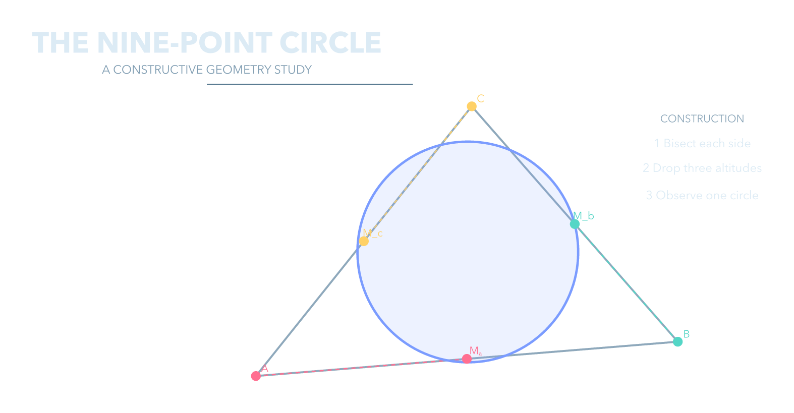 | 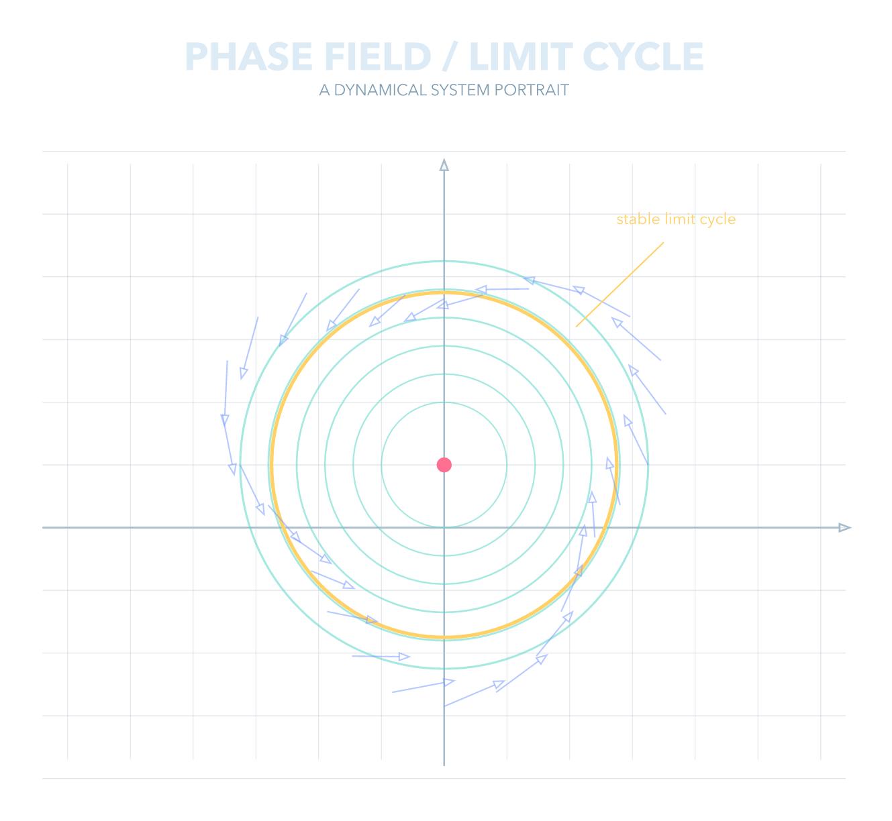 | 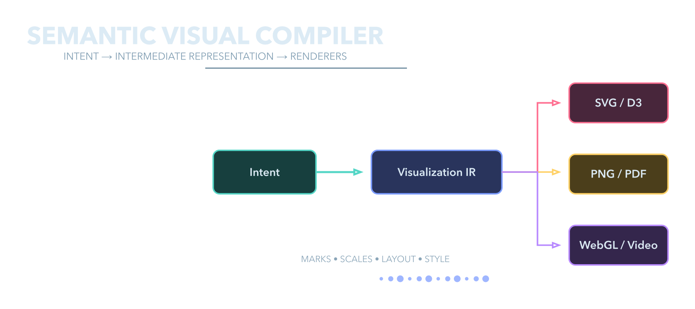 | 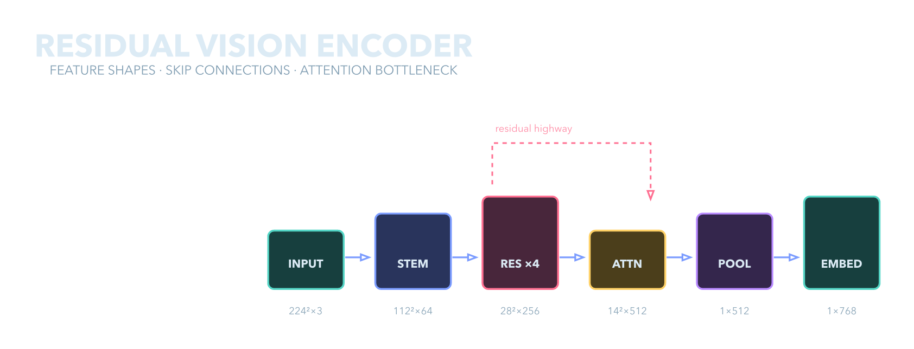 |
| Orbital mechanics | Circuit | Bézier anatomy | Roadmap |
|  | 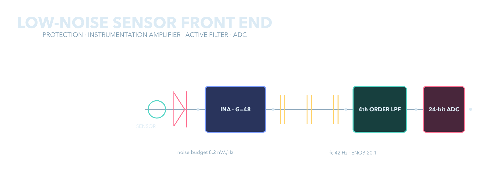 | 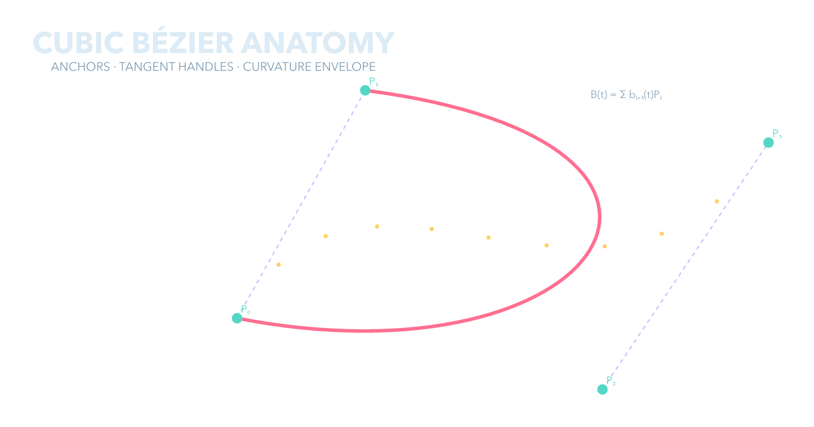 | 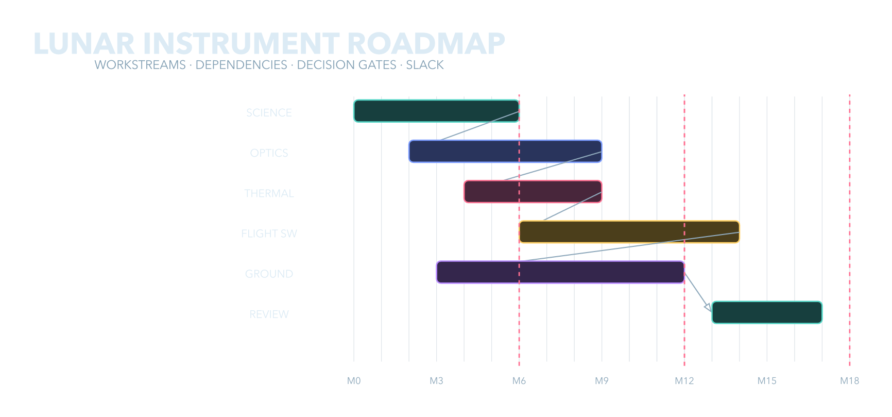 |
| Matrix transforms | Topography | Molecule | Type scale |
| 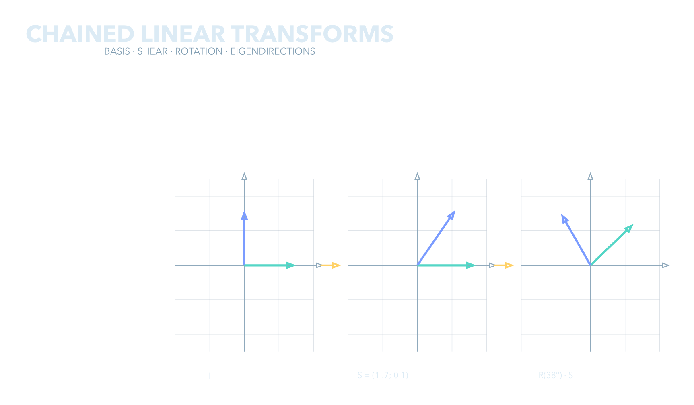 | 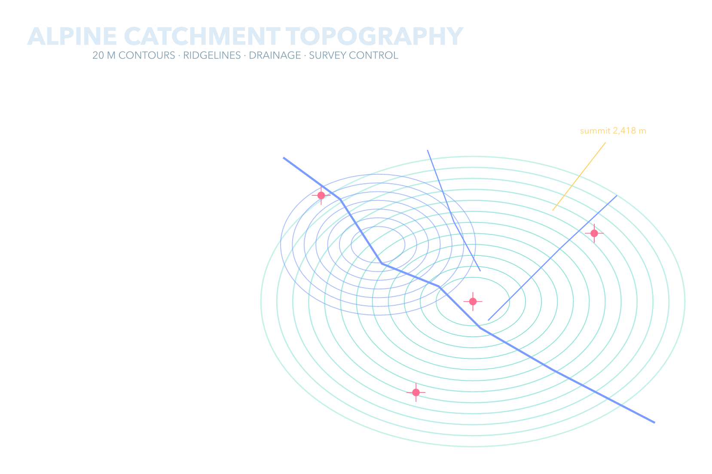 | 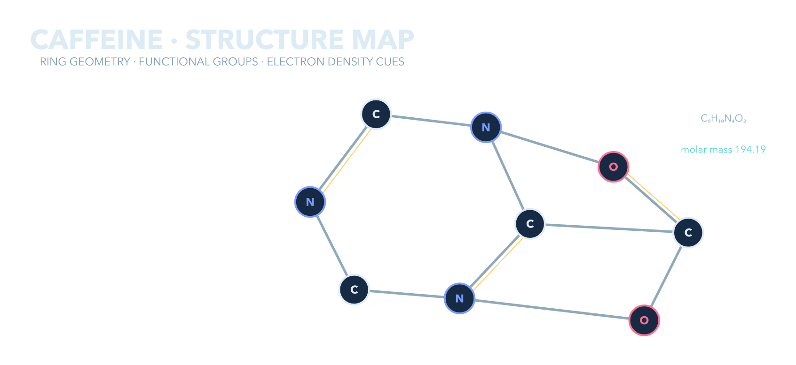 | 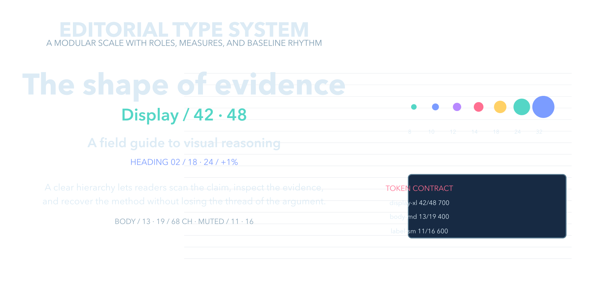 |

```bash
uv sync
uv run python tools/render.py
```

The renderer invokes the installed Typst compiler and rejects outputs that lack transparent, visible, or chromatic pixels.

Each scene compiles into an exclusively created temporary PNG in `out/`.
After Pillow decodes it and the existing RGBA checks pass, `os.replace`
atomically publishes the compiler's unchanged bytes at the final filename.
Compiler, image-validation and publication failures leave the previous image
intact; cleanup removes only that invocation's temporary file. A cleanup error
is attached to the original failure and may leave that temporary file behind.
The private temporary file's permissions carry over to the published image.

Publication is per scene: earlier successful scenes remain published if a
later one fails. Concurrent successful renders use independent temporary
files, with the last replacement winning. This does not provide a whole-batch
transaction or power-loss durability. Replacing a final-name symlink replaces
the link itself, without writing its target.

`just test` retains the full real-render gate and also runs publication
regressions using temporary directories, real Pillow images and a fake
compiler boundary. Run only those local regressions with
`uv run python -m unittest discover -s tests -v`.
